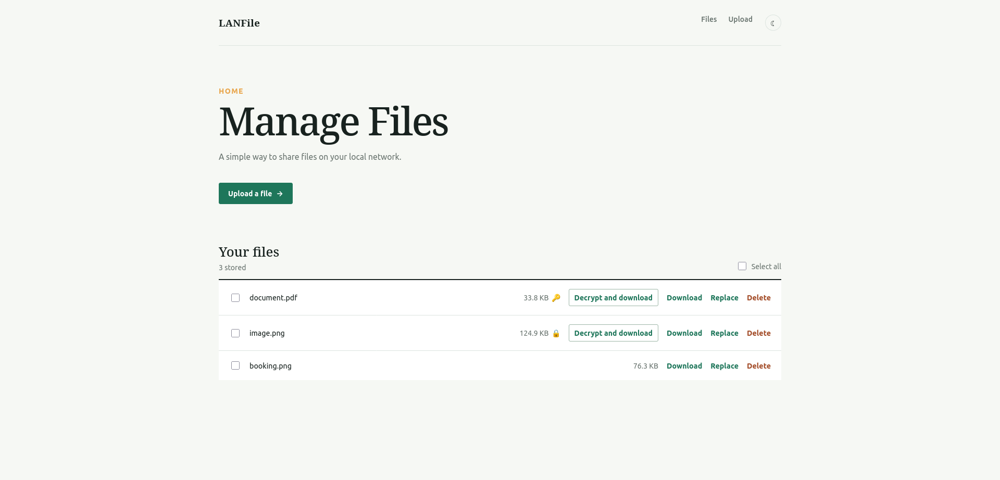

# LANFile

> Simple, zero-setup file sharing over your local network.

LANFile is a lightweight file-sharing server designed for **LAN use**, not public hosting. It lets anyone on your network upload and download files using nothing more than a web browser or command-line tools like `curl` and `wget`.

No accounts, no advanced configuration, no external client-side tools.

---

## Features

### Available

* [x] Upload files via CLI (`curl`, `wget`)
* [x] Upload files via the Web UI
* [x] Download files via CLI
* [x] Download files via the Web UI
* [x] Password-based file encryption/decryption in the Web UI
* [x] GPG encryption/decryption support via CLI

### Planned

* [ ] Authentication for overwriting files (password or key)
* [ ] Pastebin-style snippet sharing via CLI and Web UI

---

## Screenshots

### Web UI



### CLI Demo


---

## API

### Download

Download a file by name or ID.

| Method | Endpoint             | Description                        |
| ------ | -------------------- | ---------------------------------- |
| `GET`  | `/d/name/{filename}` | Download by filename (when unique) |
| `GET`  | `/d/id/{fileID}`     | Download by file ID                |

Example:

```bash
curl -O http://server/d/name/example.txt
```

---

### Upload

Upload a file by name or ID.

| Method | Endpoint             | Description                           |
| ------ | -------------------- | ------------------------------------- | 
| `PUT`  | `/u/name/{filename}` | Upload a file with a specific filename|
| `PUT`  | `/u/id/{fileID}`     | Update an existing file by ID         |

Example:

```bash
curl -T example.txt "http://server/u/name/example.txt"
```

#### Query Parameters

| Parameter    | Values                    | Default | Description                                                  |
| ------------ | ------------------------- | ------- | ------------------------------------------------------------ |
| `encryption` | `key`, `password`, `none` | `none`  | Indicates the file's encryption method (informational only). |
| `overwrite`  | `true`, `false`           | `false` | Overwrite an existing file with the same name for `/u/name/{filename}`. |

---

### Search

Search for files by name or ID.

| Method | Endpoint               | Description                               |
| ------ | ---------------------- | ----------------------------------------- |
| `GET`  | `/s/name/{searchTerm}` | Search by filename (substring by default) |
| `GET`  | `/s/id/{searchTerm}`   | Search by exact file ID                   |
| `GET`  | `/s/getall`            | List all stored file metadata             |

#### Query Parameters

| Parameter | Values          | Default | Description                                                 |
| --------- | --------------- | ------- | ----------------------------------------------------------- |
| `exact`   | `true`, `false` | `false` | Require an exact filename match for `/s/name/{searchTerm}`. |

Example:

```bash
curl "http://server/s/name/report?exact=true"
```

---

## Security

LANFile is intended for **trusted local networks**. It is **not** designed as a public-facing file-sharing service. By default, anyone with access to the webserver can upload, overwrite, and download files without authentication.

Planned security improvements include authenticated file overwrites using passwords or cryptographic keys.
